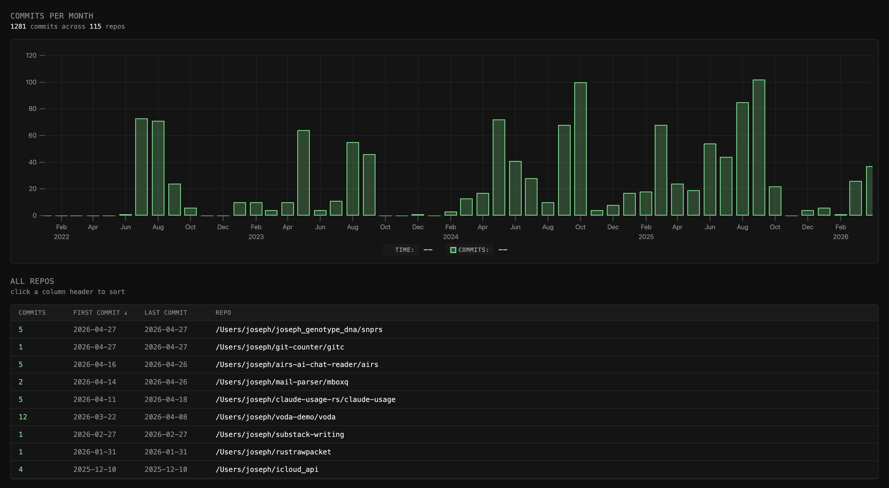

# gitc

Scans your filesystem for git repos, counts commits authored by you, and renders
an interactive HTML report (monthly bar chart + sortable repo table).

Identity is read from `git config user.name` per-repo, falling back to your
global config. Repos with no `user.name` set are skipped.

## Requirements

- [`fd`](https://github.com/sharkdp/fd) on your `$PATH` (`brew install fd` on macOS, `cargo install fd-find` anywhere, or `apt install fd-find` on Debian/Ubuntu — note that apt installs the binary as `fdfind`, so you'll need `alias fd=fdfind` or symlink it)
- `git config --global user.name` set (or per-repo)

## Install

From GitHub:

~~~
cargo install --git https://github.com/yourusername/gitc
~~~

Or from a clone:

~~~
git clone https://github.com/yourusername/gitc
cd gitc
cargo install --path .
~~~

## Usage

~~~
gitc
~~~

Scans `$HOME`, writes `/tmp/gitc.html`, opens it in your browser.

## Ignoring directories

Create `~/.gitc-ignore` with one pattern per line. Patterns are passed to `fd`
via `-E` and match as path substrings. Lines starting with `#` are comments.

Example `~/.gitc-ignore`:

~~~
# gitc ignore patterns — one per line, # for comments.
# matches as a path substring (passed to fd via -E).
# put this file at ~/.gitc-ignore

node_modules
Library
.Trash
.cache
Downloads
Documents
.rustup
.cargo
.npm
.pnpm-store
.yarn
.gem
.bundle
.pyenv
.nvm
go/pkg
target
dist
build
.venv
venv
__pycache__
~~~

Without this file, gitc still walks every `.git` dir under `$HOME` — slower and
noisier, but works.